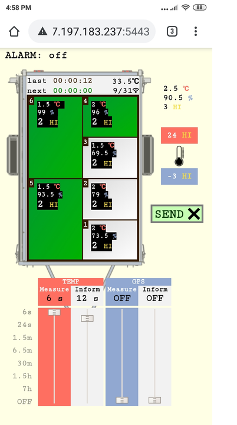

# Teplomer IOT - zariadenie na monitorovanie teploty v psích boxoch

Toto zariadenie som vyrobil pre svojho brata, ktorý sa zúčastňuje pretekov psích záprahov. Na prevoz a ubytovanie psov na podujatí používa prívesný vozík s nadstavbou, kde majú psy svoje boxy. Tieto boxy sú dobre tepelne izolované na zimné obdobie, čo ale vytvára riziko prehriatia psa v teplejšom počasí. Teplotu teda treba pravidelne kontrolovať a regulovať otváraním dverí. Teplota v boxe ale nezávisí len od vonkajšieho počasia, zvýši sa, napríklad, aj keď je pes nervózny, čo majiteľ nedokáže predvídať.

Na pomoc v tejto situácii som teda vytvoril zariadenie ktoré boxy monitoruje elektronicky, pomocou teplotno-vlhkostných senzorov. 
V prípade, že prostredie dosiahne nezdravé hodnoty, upozorní majiteľa zatelefonovaním. 
Meria sa nie len teplota, ale aj vlhkosť, aby sa z týchto veličín odvodila hodnota takzvanej [**pocitovej teploty**](https://en.wikipedia.org/wiki/Heat_index).
Tá je korektnejším ukazovateľom komfortu psieho tela ako len teplota samotná.
 

* Zariadením je počítač [**Raspberry Pi**](https://www.raspberrypi.org/products/raspberry-pi-zero-w/), ktorý je uložený v plastovej krabičke spolu s ďalšou potrebnou elektronikou. 
**Inštalácia zariadenia je jednoduchá a rýchla**. Krabičku stačí vložiť do predripraveného priestoru vo vozíku, 
pripojiť kábel napájania senzorov a zapnúť zariadenie stlačením tlačidla. Zariadenie je ďalej už sebestačné a 
ďalšia interakcia s užívateľom prebiaha už len pomocou webovej aplikácie.

* Užívateľ si pomocou aplikácie určí **základné nastavenia**: 
  * Interval hodnôt pocitovej teploty, ktorý bude považovaný za zdravý
  * Boxy, ktoré je treba aktuálne monitorovať

* Ak nameraná pocitová teplota v niektorom z boxov prekročí stanovené hranice, zariadenie spustí poplach tak, že 
užívateľovi **zavolá na mobilný telefón**. _Táto funkcionalita je k dispozicii vďaka [**GSM/GPRS modulu**](https://www.waveshare.com/gsm-gprs-gnss-hat.htm)._

* **Kontrola zdravosti prostredia je ošetrená od náhodných vplyvov okolia**. Namerané hodnoty na senzore nemusia stále odpovedať stavu v celom boxe. 
Vietor na senzore, manipulácia s vozíkom, psí dych na senzore a ďalšie vplyvy môžu spôsobiť zavádzajúce výsledky meraní. 
Preto sú merania vyhodnocované algoritmom ktorý pomáha predísť falošným poplachom alebo, naopak, prehliadnutiu kritických situácii.

* Zariadenie zasiela informácie o svojom nastavení na webovú aplikáciu v pravidelných intervaloch. Vďaka tomu si užívateľ môže 
kedykoľvek pohodlne **skontrolovať, že zariadenie funguje, a že je správne nastavené**. Okrem toho, aplikácia zobrazuje dalšie užitočné 
informácie, najmä aktuálne namerané hodnoty v každom boxe.

* Počas štandardnej prevádzky nie je k dispozícii pripojenie na elektrickú sieť, preto je zariadenie napájané z vlastnej batérie. 
Spotreba batérie je nízka, vydrží približne 24 hodín pri neustále zapnutom zariadení. Preteky ale trvajú často dlhšie. 
Okrem ľahko vymeniteľnej náhradnej batérie je preto k dispozícii **funkcia šetrenia batérie**. Štandardne, sa kontrola boxov vykoná 12-krát za minútu, 
čo ale vo väčšine prípadov nie je nevyhnutne potrebné. Túto frekvenciu je preto možné znížiť, a už pri frekvencii 1 kontrola za 3 minúty 
sa zariadenie samé vypína medzi meraniami, čím sa šetrí batéria. 
_Táto funkcionalita je k dispozicii vďaka modulu [**WittyPi**](http://www.uugear.com/product/wittypi2)._

* Podobným spôsobom je umožnené **šetrenie mobilných dát**, ktoré sú spotrebuvávané pri komunikácii medzi aplikáciou a zariadením. 
Užívateľ má možnosť frekvenciu tejto komunikácie zmeniť, čím priamo ovplyvňuje spotrebu dát.
       

 ## Github Repository
V tomto repository nájdete kód celého projektu:
* [Zariadenie](https://github.com/MarekDrabik/Teplomer/tree/master/Zariadenie) - kód hlavného zariadenia (Python)
* [Server](https://github.com/MarekDrabik/Teplomer/tree/master/Server) - kód servera, ktorý umožňuje komunikáciu medzi zariadením a webovou aplikáciou (Node.js) 
* [Server/public](https://github.com/MarekDrabik/Teplomer/tree/master/Server/public) - kód webovej aplikácie (Javascript, html, css)

