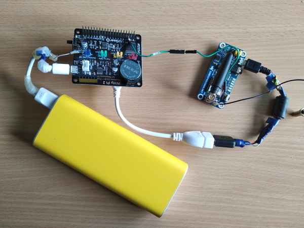
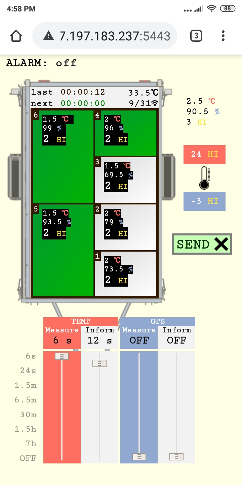
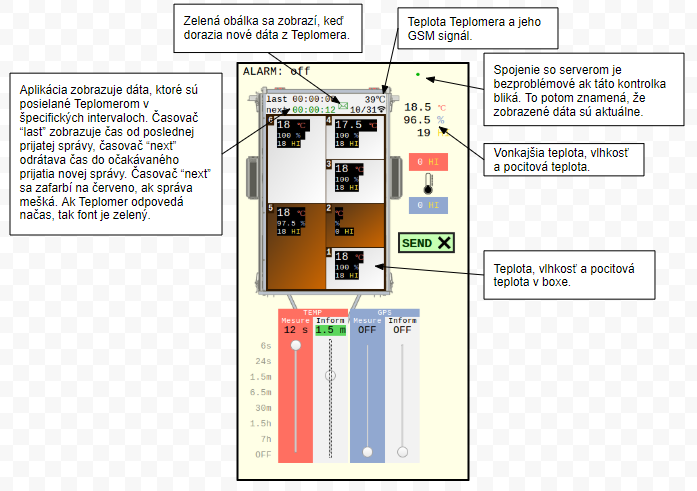
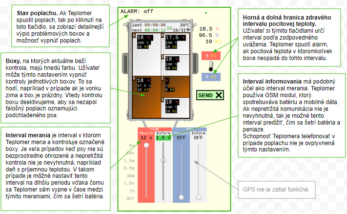

# Teplomer IOT

Teplomer IOT je zariadenie na monitorovanie teploty v psích boxoch s funkciou alarmu. Vytvoril som ho pre svojho brata, ktorý sa zúčastňuje pretekov psích záprahov. Na prevoz a ubytovanie psov na podujatí používa prívesný vozík s nadstavbou, kde majú psy svoje boxy. Tieto boxy sú dobre tepelne izolované na zimné obdobie, čo ale vytvára rizoko prehriatia v teplejšom počasí. Teplotu teda treba pravidelne kontrolovať a regulovať otváraním/zatváraním dverí. Teplota v boxe nezávisí iba od vonkajšieho počasia, zvýši sa napríklad aj keď je pes nervózny, čo majiteľ nedokáže predvídať. Riziko je teda veľké a závislé nie len od poctivosti majiteľa ale často nepredvídateľné.
  

Na pomoc tejto situácii som teda prišiel s myšlienkou monitorovania teploty automatizovane, ktorú sa mi aj podarilo zrealizovať.

Výsledkom je kompaktné zariadenie ktoré monitoruje komfort psov pomocou teplotného senzoru v každom boxe. V pripade prekrocenia stanoveneho limitu v niektorom z nich, upozorni majitela tak, ze mu zavola na telefon.

Zariadením je počítač raspberry pi, ktorý je uložený v plastovej krabičke spolu s ďalšou potrebnou elektronikou. Inštalácia zariadenie je jednoduchá a rýchla, krabičku stačí vlozit do predripraveneho priestoru vo voziku, pripojit kábel napájania senzorov a zapnut zariadenie stlačením tlačidla. Zariadenie je ďalej už sebestačné a ďalšia interakcia s užívateľom prebiaha už len pomocou webovej aplikácie.
Uzivatel si v nej navoli hranicne hodnoty pocitovej teploty (podchladenie / prehriatie ) ktoré uz nemaju byt tolerovane, a taktiez urci ktore konkretne boxy je treba monitorovat.
Zariadenie nemeria iba teplotu, ale aj vlhkost, a z tychto velicin rata takzvanu [**pocitovú teplotu**](https://en.wikipedia.org/wiki/Heat_index). To je korektnejsi ukazovatel komfortu psieho tela ako len teplota samotna.

Ak namerana pocitova teplota v niektorom z boxov prekroci stanovene hranice, zariadenie spusti poplach tak, ze uzivatelovi zavola na mobilny telefon. *Tato funkcionalita je k dispozicii vdaka GPRS modulu s vlastnou SIM kartou.*

Teplota namerana senzormi nemusi stale odpovedat skutocnej hodnote v boxe. Nahodne vplyvy ako vietor, manipulacia s boxom, psí dych na senzore môže spôsobiť nesprávne vyhodnotenie situácie. To môže mať za následok falošné poplachy alebo, čo je horšie, prehliadnutie kritických situácií. Z toho dovodu je implementovany algoritmus ktory zdravost teploty hodnoti statisticky. 

Zariadenie zasiela informacie o svojom nastaveni na webovu aplikaciu v pravidelnych intervaloch. Vdaka tomu si uzivatel moze kedykolvek pohodlne skontrolovat, že zariadenie funguje a ze je spravne nastavene. Okrem toho, aplikacia zobrazuje dalsie uzitocne informacie, najme aktualne namerane hodnoty v kazdom boxe.

Počas štandardnej prevádzky nie je k dispozícii pripojenie na elektrickú sieť, preto je zariadenie napájané z vlastnej batérie. Spotreba batérie je nízka a vydrží približne 24 hodín pri neustále zapnutom zariadení. Preteky trvajú ale často dlhšie. Okrem ľahko vymeniteľnej náhradnej batérie je preto k dispozicii funkcia šetrenia batérie. Štandardne, sa kontrola boxov vykoná 12-krát za minútu, čo ale vo väčšine prípadov nie je nevyhnutne potrebné. Túto frekvenciu je preto možné znížiť, a už pri frekvencii 1 kontrola za každé 3 minúty sa zariadenie samé vypína medzi meraniami, aby ušetrilo batériu. *Táto funkcionalita je k dispozicii vdaka modulu WittyPi.*

Rovnakým spôsobom je možné šetrenie mobilných dát ktoré sú spotrebované pri komunikácii medzi aplikáciou a zariadením. Užívateľ má možnosť frekvenciu tejto komunikácie zmeniť, čím priamo ovplyvňuje spotrebu dát.

 

1 V idealnom pripade, je zariadenie na monitorovanie byt mobilne, skladne a čo najmenej narocne na obsluhu. 
RIESENIE: * Teplomer je počítač **Raspberry Pi** s ďalšími pridanými modulmi  a batériou, ktorý je uložený v plastovej krabičke. Táto krabička sa vkladá do zadnej časti prívesného vozíka kde sa zapojí na kabeláž senzorov. Po spustení, stlačením tlačidla, je už ďalej ovládané webovou aplikáciou a žiadna ďalšia manipulácia nie je nutná.

ľ. Zariadenie potrebuje vlastny zdroj elektrickej energie vzhladom na to, ze vozik je pocas pretekov zvacsa odparkovany mimo dosahu elektrickej siete.

 * meria sa nielen teplota ale aj vlhkosť z čoho sa potom počíta takzvaná , čo je relevatnejší ukazovateľ komfortu tela
 * zariadenie upozorňuje užívateľa na problém **zavolaním na telefón**
 * počítač kontroluje nielen to či je teplota na senzoroch v zdravom rozsahu, ale aj to či sa niektorý senzor nezasekol, alebo či je teplota ustálená 
 * k dispozícii je **webová aplikácia** ktorá zobrazuje informácie Teplomera a ponúka možnosti jeho nastavenia
   * okrem iného, zobrazuje hlavne **teplotu a vlhkosť v jednotlivých boxoch**
   * na **šetrenie batérie**, ktorá vydrží približne 24 hodín pri neustálom behu, je možné zvýšiť interval v akom má Teplomer merať a počítač sa potom sám vypne medzi týmito meraniami.
   * na **šetrenie mobilných dát** je zase môžné prestaviť interval informovania
 

## Možnosť reálne vyskúšať 
Aplikácia je k dispozícii na vyskúšanie na adrese: https://87.197.183.237:5443/home  
Na zobrazenie stránky je potrebné odsúhlasiť bezpečnostnú výnimku na certifikát.

Ak o to teda máte záujem a dáte mi vedieť, tak ja zapnem aj Teplomer, aby aplikácia zobrazovala reálne dáta.  

**Prihlasovacie údaje:**  
meno: _teplomer_  
heslo: _Jk2;Ak1ma_  

 
## Github Repository
V tomto repository nájdete kód celého projektu:
* [Zariadenie](https://github.com/MarekDrabik/Teplomer/tree/master/Zariadenie) - celý kód Teplomera, teda toho zariadenia ktoré je vložené do prívesného vozíka (Python)
* [Server](https://github.com/MarekDrabik/Teplomer/tree/master/Server) - backend kód servera ktorý beží doma na druhom Raspberry Pi (Node.js) 
* [Server/public](https://github.com/MarekDrabik/Teplomer/tree/master/Server/public) - frontend webová aplikácia (Javascript, html, css)

## Detailný popis Web Aplikácie

1. Web aplikácia zobrazuje základné informácie o stave vo vozíku.

2. Ponúka možnosť zmeniť nastavenia Teplomera. 
_Zmenené hodnoty blikajú nazeleno v pozadí so súčastným nastavením. Nastavenia sa odosielajú rázovo tlačidlom SEND a potom čakajú na serveri kým ich Teplomer neprevezme._
   

